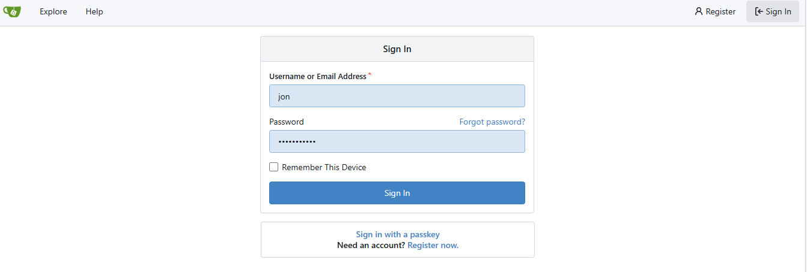
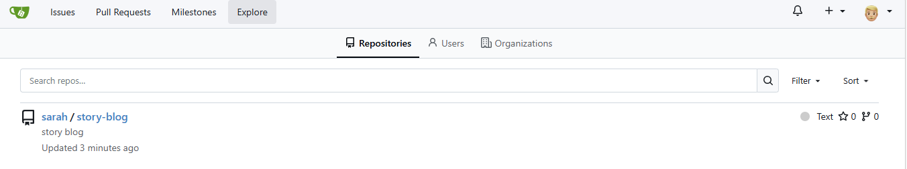
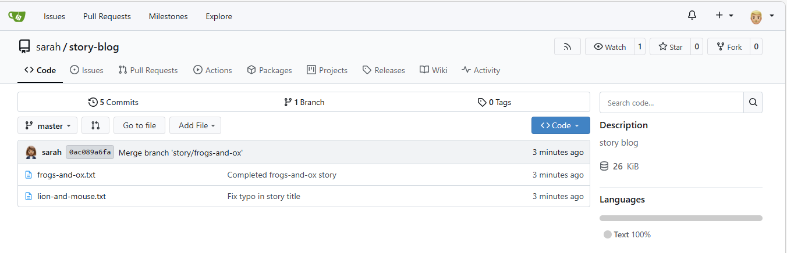
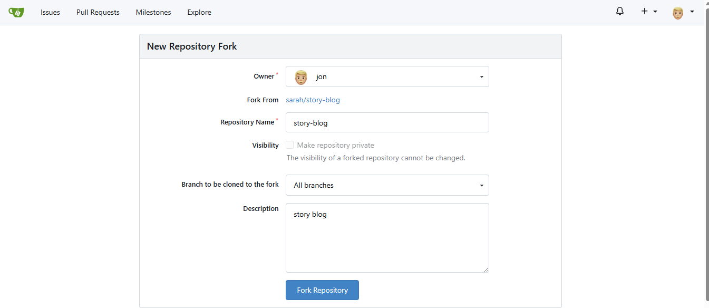
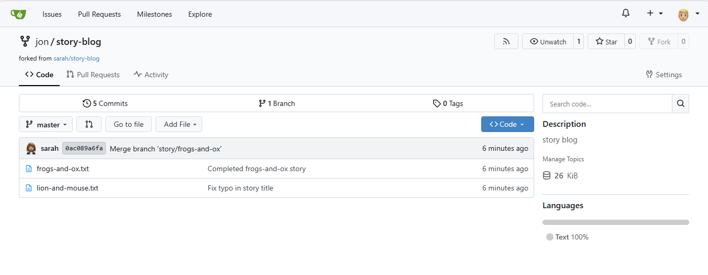

# Day 23: Fork a Git Repository
## Task
There is a Git server utilized by the Nautilus project teams. Recently, a new developer named Jon joined the team and needs to begin working on a project. To begin, he must fork an existing Git repository. Follow the steps below:
1. Click on the Gitea UI button located on the top bar to access the Gitea page.
2. Login to Gitea server using username jon and password Jon_pass123.
3. Once logged in, locate the Git repository named sarah/story-blog and fork it under the jon user.
## Solution
### 1️⃣ Open the Gitea UI
In your lab environment:

Click “Gitea UI” from the top bar.

This opens the Git web server used by the Nautilus team.
### 2️⃣ Login

Use the credentials provided:
```sh
Username: jon
Password: Jon_pass123
```

Then click Sign In.

### 3️⃣ Find the repository

After logging in:

Use the explore repositories.

Open the repository:
```sh
sarah/story-blog
```
Here:
```sh
sarah = owner
story-blog = repository name
```
### 4️⃣ Fork the repository

Inside the repository page:

Click the Fork button (top-right of the page).

Choose the jon account as the destination.

And Press Fork Repository
### 5️⃣ Verify the fork
After the fork finishes, you should see:
```sh
jon / story-blog
```

This means:
```sh
Original repo: sarah/story-blog
Your fork:     jon/story-blog
```
### 🧠 Why Forking?

Forking creates:
```sh
Original Repo
sarah/story-blog
        │
        └── Fork
            jon/story-blog
```
Jon now has:

- Full write access
- His own copy of the repository
- Ability to create branches and changes
- Later he can create a Pull Request back to Sarah's repository.